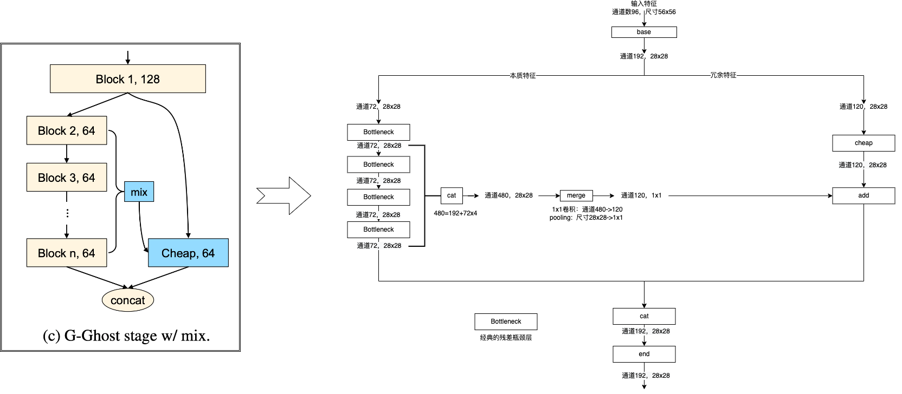

# GhostNets on Heterogeneous Devices via Cheap Operations

#### 该仓库收录于[PytorchNetHub](https://github.com/bobo0810/PytorchNetHub)

# 说明

- CVPR2020 C-GhostNet
- IJCV 2022  G-GhostNet  [官方库](https://github.com/huawei-noah/Efficient-AI-Backbones)     [原作知乎解读](https://zhuanlan.zhihu.com/p/540547718)

## 简读

| 主题 | 描述                                                         |
| ---- | :----------------------------------------------------------- |
| 问题 | 问题1：深度可分离卷积（逐通道卷积+逐点卷积）、通道打乱等复杂操作在GPU下并行度不高，造成耗时。 问题2：观察到stage级别内部特征存在冗余。 |
| 解决 | 问题1：仅采用普通卷积/分组卷积，加速GPU并行 问题2：在stage级别应用Ghost形式，用"便宜操作"生成冗余特征。 |
| 实现 | C-Ghost:  卷积级别特征冗余，代替原来的一个普通卷积  G-Ghost:  stage级别特征冗余，以代替原来的一个stage网络结构 |

# 具体实现

核心方法`Stage` 

