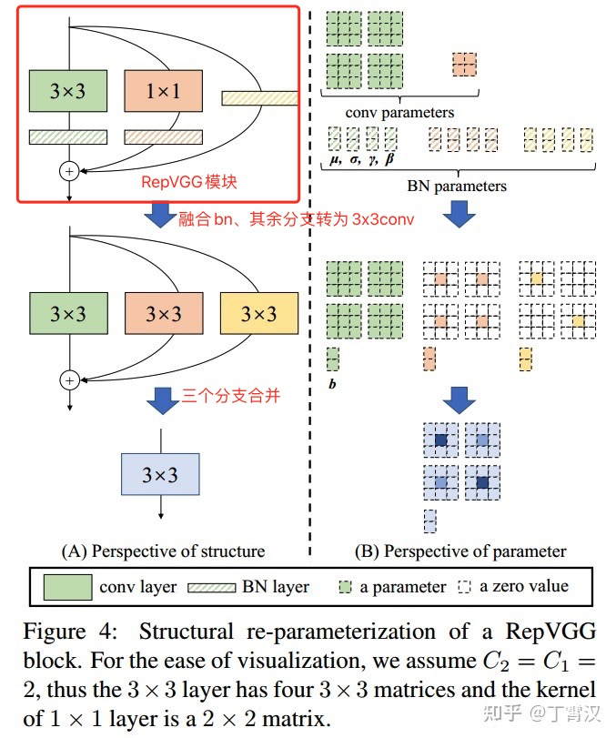

# RepVGG: Making VGG-style ConvNets Great Again

#### 该仓库收录于[PytorchNetHub](https://github.com/bobo0810/PytorchNetHub)

# 说明

- CVPR-2021 [官方库](https://github.com/DingXiaoH/RepVGG)    [原作知乎解读](https://zhuanlan.zhihu.com/p/344324470)

- 本仓库仅提取网络定义部分，用以分析。

- 应用广泛

  > 1. [yolov6](https://zhuanlan.zhihu.com/p/533127196)、[yolov7](https://arxiv.org/abs/2207.02696)等：设计结构重参数化的网络进行训练，推理时转化为等价的简单结构，加速推理。
  >2. [MNN线性超参数化工具](https://www.yuque.com/mnn/cn/ph6021)：设计小模型 --> 训练线性过参数化大模型 --> 转换等价小模型推理

## 简读

|          |                                                              |
| -------- | ------------------------------------------------------------ |
| 问题     | 问题1：resnet等多分支结构，造成内存消耗，推理速度下降。 问题2：depthwise等复杂操作，造成内存消耗，硬件支持差。 |
| 创新点   | RepVGG是VGG结构，快速、省内存、灵活  解决问题1：推理时无分支  解决问题2：仅包含3x3conv+ReLU的VGG style结构，无复杂操作 |
| 具体实现 | 解耦训练和推理的网络结构。   训练：多分支提升性能  推理：结构重参数化，转为等价的VGG style结构。 |

# 具体实现

核心方法`get_equivalent_kernel_bias`

1. 融合BN

   `conv layer + BN layer  `-->  `conv layer`

   - [详解BN层](https://blog.csdn.net/ECNU_LZJ/article/details/104203604)

   - [卷积与BN层融合公式](https://blog.csdn.net/oYeZhou/article/details/112802348)

2. 其余分支转为3x3卷积

   1x1conv -> 3x3conv        

   bn->3x3conv

3. 三个分支合并

   `conv(x, W1) + conv(x, W2) + conv(x, W3) = conv(x, W1+W2+W3)）`

 

