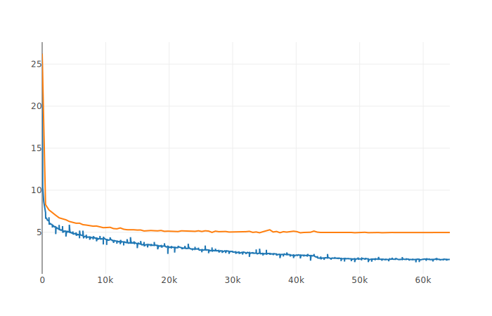
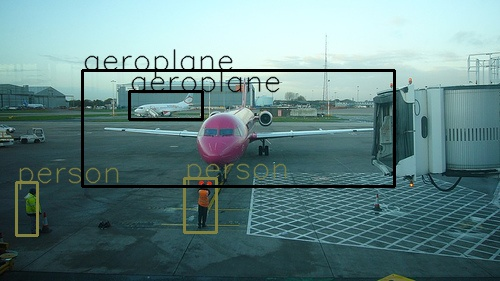
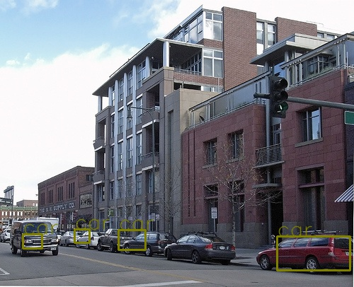

## pytorch YOLO-v1

[中文](中文.md)

**This is a testing repository, which can not repeat the result in original [paper](https://arxiv.org/pdf/1506.02640.pdf)**

**I will lead a discussion later, if you are interested in it, it will be welcome to contact me. If you find any bug in it, please let me know.**

I write this code for learning useage. In yoloLoss.py, i write forward only, with autograd mechanism, backward will be done automatically.

### 1. Dependency
- pytorch 0.2.0_2
- opencv
- visdom
- tqdm

### 2. Prepare

1. Download voc2012train dataset
2. Download voc2007test dataset
3. Convert xml annotations to txt file, for the purpose of using dataset.py, you should put the xml_2_txt.py in the same folder of voc dataset, or change *Annotations* path in xml_2_txt.py 

### 3. Train
Run python train.py

*Be careful:* 1. change the image file path 2. I recommend you install [visdom](https://github.com/facebookresearch/visdom) and run it

### 4. Evaluation
Run python eval_voc.py

*be careful* 1. change the image file path

### 5. Discussion

1. Overfit problem

I draw the training loss curve and testing loss curve, it is obvious it has overfitting. I did many data augmentation to overcome it, but it improved little.

2. Activation function in the last fc layer

The origin paper use linear activation functiona for the final layer, it's output will in [-inf,+inf], but the target is in [0,1], so i use sigmoid activation function to replace it. I think this is more reasonable, if you konw the detail about it, please let me know.

Update: I did another experiment. I use linear activation, set learning rate carefully as the paper, and replace sqrt(w), sqrt(h) to (wh) to avoid nan problem. But the result is not good too.

### 6. result
1. on the train dataset, map is about 0.5~. Some result image is in trainIMgresult

2. on the test dataset, map is about 0.2~. Some result image is in testIMGresult. test result is not well.

